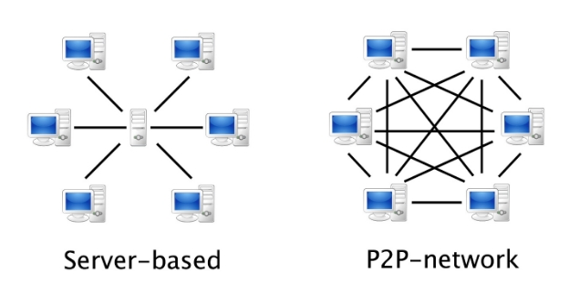
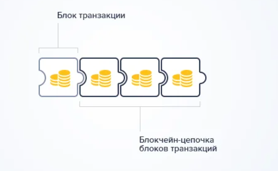
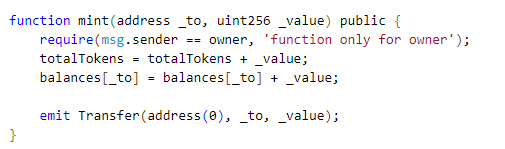

31

МИНИСТЕРСТВО ПРОСВЕЩЕНИЯ РОССИЙСКОЙ ФЕДЕРАЦИИ

Федеральное государственное бюджетное образовательное учреждение 

высшего образования

«Благовещенский государственный педагогический университет»

Физико-математический факультет

Кафедра информатики и методики преподавания информатики

КУРСОВАЯ РАБОТА

на тему: Проектирование программного обеспечения биржи для спотовой торговли на основе децентрализованной компьютерной сети Ethereum

по дисциплине: Учебная практика (научно-исследовательская работа)

|
Исполнитель:

студент группы 4 «А»
|
 

\_\_\_\_\_\_\_\_\_\_\_\_\_\_\_\_\_\_\_

дата
|
 

\_\_\_\_\_\_\_\_\_\_\_\_\_\_\_\_\_\_\_\_

подпись
|
 

А.Г. Гулак
|
| :- | :- | :- | -: |
|
Руководитель:

ст. преподаватель
|
 

\_\_\_\_\_\_\_\_\_\_\_\_\_\_\_\_\_\_

дата
|
 

\_\_\_\_\_\_\_\_\_\_\_\_\_\_\_\_\_\_\_\_\_

подпись
|
 

А.М. Апалеева
|

Благовещенск 2022
# СОДЕРЖАНИЕ

[ВВЕДЕНИЕ	3](#_toc121393299)

[1	Анализ предметной области	5](#_toc121393300)

[1.1	Определение технологии блокчейн	5](#_toc121393301)

[1.2	Принципы технологии блокчейн	9](#_toc121393302)

[1.3	Процесс верификации в блокчейн	11](#_toc121393303)

[1.4	Смарт-контракты	13](#_toc121393304)

[1.5	Блокчейн Ethereum	16](#_toc121393305)

[1.6	Цифровизация активов при помощи взаимозаменямых токенов (стандарт ERC20)	18](#_toc121393306)

[1.7	Участники биржи и основные элементы	23](#_toc121393307)

[1.8	Анализ децентрализованных бирж	24](#_toc121393308)

[2	Проектирование веб-сервиса	26](#_toc121393309)

[2.1	Выбор целевой операционной системы	26](#_toc121393310)

[2.2	Клиентская часть	26](#_toc121393311)

[2.3	Серверная часть	29](#_toc121393312)

[2.4	Разработка архитектуры веб-сервиса	30](#_toc121393313)

[2.5	Интерфейс веб-сервиса	31](#_toc121393314)

[2.6	Авторизация	33](#_toc121393315)

[2.7	Заявки и их обработка	35](#_toc121393316)

[2.8	Взаимодействие блокчейна и сервисной части	37](#_toc121393317)

[2.9	Проектирование структуры базы данных	38](#_toc121393318)

[ЗАКЛЮЧЕНИЕ	42](#_toc121393319)

[СПИСОК ИСПОЛЬЗОВАННЫХ ИСТОЧНИКОВ	43](#_toc121393320)

**

# ВВЕДЕНИЕ

Децентрализованная биржа (далее – DEX) – одноранговая торговая площадка, где все транзакции проходят напрямую между участниками торгов. DEX выполняет одну из основных возможностей блокчейна: транзакции не контролируются банками, брокерами, платежными системами или любыми другими посредниками.

Децентрализованная биржа работает на основе программ, выполняемых на виртуальной машине блокчейна (известны как смартконтракты). В то время как в централизованной бирже все транзакции записываются во внутреннюю базу и полностью подконтрольны сервису, транзакции в DEX рассчитываются в блокчейне и проверяются независимыми проверяющими.

Более того, DEX практически не подвержены взлому из-за того, что все активы пользователей хранятся на их собственных кошельках. Также одним из основных преимуществ децентрализованных бирж является полная анонимность участников торгов.

Актуальность работы заключается в том, что с учетом текущих санкций, которые вызвали блокировки международных финансовых систем, появляется острая необходимость в одноранговых инструментах, в которых отсутствует какая-либо централизация.

Целью данного проекта является разработка трейдинговой площадки для спотовой и фьючерсной торговли, на которой будет возможна торговля криптоактивами. При этом она должна не только совмещать преимущества блокчейна, но и использовать сервисные средства для увеличения пропускной способности.

Перед разрабатываемым веб-сервисом ставится задача реализации следующих функциональных возможностей:

- авторизация пользователя через подпись приватным ключом;
- создание и сопоставление заявок;
- администрирование торговой площадки;
- взаимодействие с блокчейном;
- отображение информации по созданным заявкам;
- сопоставление заявок.

Для реализации данных задач необходимо:

1. Изучить технологию блокчейн и стандарты смартконтрактов.
1. Проанализировать блокчейн, выбранный для данного проекта.
1. Изучить и выбрать технологии для разработки.
1. Разработать структуру проекта.
1. Спроектировать базу данных для веб-сервиса.
1. Спроектировать клиентскую и серверную части веб-сервиса.

1. Анализ предметной области

1. Определение технологии блокчейн

Первоначально следует разобраться с таким понятием как blockchain. Технология, известная, как «блокчейн» была впервые представлена Сатоши Накомото в его статье “Bitcoin: A Peer-to-Peer Electronic Cash System”, в которой изложена математическая основа для криптовалюты «Bitcoin». Хотя это была новаторская статья, она никогда не представлялась в традиционном рецензируемом журнале, а подлинная личность автора неизвестна. 

Технология блокчейн не только лежит в основе всех криптовалют, но и находит широкое применение в более традиционной финансовой индустрии. Она также открыла двери для новых приложений, таких как «смарт-контракты».

Проблема, которую Накомото разрешил с помощью цепочки блоков, заключалась в установлении доверия к децентрализованной (распределенной) системе. Конкретнее, проблема создания распределенного хранилища временных файлов в то время, как ни одна из сторон не может вмешиваться в содержание данных или в отметки времени без обнаружения. 

Стоит обратить внимание на то, что эта проблема ортогональна (параллельна) проблемам аутентификации, целостности и ненарушения, которые решаются с помощью цифровых подписей. Если сторона создает электронную подпись для документа, она устанавливает только проверяемую связь между стороной и документом. Наличие действительной цифровой подписи доказывает, что сторона действительно намерена подписать документ, и что документ не был изменен. Однако цифровая подпись не гарантирует ничего о времени, в которое документ был подписан: отметка времени требует доверия к стороне, которая ее подписала. В случае финансовых операций и других форм юридических договоров время имеет существенное значение, и порядок этих финансовых транзакций должен быть независимо сертифицирован для проведения аудита. 

Положительные качества блокчейна и биткоина можно рассмотреть на сделках, связанных с недвижимостью. Владелец может быть определен как сторона, которой последний раз был продан дом, но право собственности может быть проверено только с полного бумажного исследования всех транзакций, связанных с домом, в некотором роде «бумажной дорожкой», которая обычно хранится и проверяется титульными компаниями. Стоит заметить, что система не полностью предотвращает мошеннические транзакции (например, человек, продающий дом, которым он не владеет, или продает одно и то же имущество более чем одной стороне), но мошеннические действия в конечном итоге обнаруживаются, как и реальное право собственности. Та же проверка собственности возникает в финансовых транзакциях – обязательно, при продаже криптовалюты, а также в продаже любого другого традиционного финансового инструмента. Обычно проблема решается путем записи всех транзакций в одном доверенном централизованном регистре, но «книга» не всегда является практическим решением, поскольку она не масштабируется для большого количества частых транзакций и потому она требует, чтобы все стороны доверяли хранителю книги. Точно так же вам нужно доверять своему банку свои деньги (а сотрудники банка, крадущие средства клиентов не редкость). Чтобы устранить это, блокчейн предоставляет механизм распределенного доверия: несколько сторон хранят записи транзакций, и каждая сторона может проверить, не были ли изменены порядок и отметки времени транзакций.

Единица биткоина – это не что иное, как число, но только некоторые цифры из него представляют из себя подтвержденный биткоин. Эти числа являются решениями четко определенного уравнения, и тот, кто находит его решение, получает какое-то количество биткоинов. Этот процесс называется майнингом. Как только биткоин обнаружен, он может участвовать в транзакциях, которые будут храниться в базе данных. Сделки подписываются цифровой подписью с учетными данными продавца, чтобы избежать отказа.

Централизованной базы данных в такой системе не существует, поскольку пользователи не доверяют ей, а также потому, что существует слишком много транзакций для хранения их всех в одном месте. Поэтому биткоин и другие криптовалюты предоставляют распределенную базу данных, в которой каждый компьютер, участвующий в транзакции определенной монеты, хранит копию истории транзакции этой монеты. Технология блокчейн гарантирует, что ни одна сторона, хранящая эту историю, не может вмешиваться в нее, оставшись незамеченным.

Децентрализованность такой системы обеспечивается технологией одноранговой сети peer-to-peer (P2P). Именно он отвечает за такую характеристику блокчейна, как хранение цепочки блоков транзакций, в которой периодически происходит добавление новых блоков у каждого участника такой системы. На рисунке 1 изображена простейшая структура P2P сети по сравнению с серверо-базисной. 

Рисунок 1 – Схематичное представление P2P и серверо-базисной сетей

Транзакции – это единицы данных, содержащие сведения о транзакции и отметке времени. Оба могут быть представлены в виде вычисленных чисел и строк.

Блокчейн можно рассматривать как цепочку блоков с тремя столбцами, где каждая строка представляет отдельную транзакцию (рисунок 2). В первом столбце хранится метка времени о транзакции. Во втором столбце хранятся сведения о транзакции. А третий столбец содержит в себе свой хэш и хэш предыдущего блока, так все блоки представляют собой единую цепочку, то есть историю всех действий в системе с начала её старта. 

Рисунок 2 – Цепочка блоков

Когда новая запись появляется в блокчейне, последний вычисленный хэш передается каждой заинтересованной стороне. Необязательно, чтобы каждая сторона хранила копию всей истории транзакций, достаточно, чтобы это сделали несколько сторон. Цепочка проходит проверку целостности на устройстве у каждого клиента сети.

Описанная структура служит гарантией того, что любое несанкционированное действие будет отвержено и признано невалидным, при такой проверке пользователями, которые хранят у себя валидные цепочки. Единственный способ вмешаться в данные при сохранении хэша – найти коллизию. Но такой способ потребует слишком много вычислительной мощности, что не будет целесообразным, и, следовательно, такой метод практически невозможен.

Примерами хэш-функций являются безопасные хэш-алгоритмы (SHA1, SHA128, SHA512 и т.д.), которые реализуются модулем hashlib в языке программирования Python. Он может принимать любую строку в качестве входных данных и всегда создавать выходную строку, которая представлена в шестнадцатеричном виде с фиксированной длиной.

1. Принципы технологии блокчейн 

Технология blockchain основывается на 4 важных принципах:

1. Проверка транзакций в сети с использованием криптографии. 

На сегодняшний день, в сферах, где используется передача данных, после отправки некоторого сообщения со сведениями, который нужно синхронизировать с получателем, получатель должен обновить свой собственный реестр с данными. На сегодняшний день не существует удобного, не затратного по времени и эффективного решения, чтобы сверять такие копии. И именно технология blockchain позволяет справиться с этой проблемой, с помощью различных способов. К примеру, при обмене одними и теми же базовыми данными или при предоставлении подтверждающих элементов с целью верификации данных. Пользователи blockchain реестра достигают соглашения в отношении верификации изменения данных используют некоторые алгоритмы консенсуса, такие как Proof of Stake, Proof Of Work, Proof Of Activity, Proof of Weight.

1. Распространение копий информации о транзакциях среди большого количества участников системы.

База данных в системе на блокчейн либо целиком, либо частями распределяется между устройствами участников системы. Это позволяет избежать критических ошибок, которые могли бы случиться на одном устройстве. На данный момент, мультиплицирование является довольно большой проблемой для нынешних технологий организации баз данных, и это приводит к внеочередным сложностям и затратам в ходе реализаций различных проектов. Кроме того, такое достоинство блокчейна позволяет сохранить целым все копии, если в одной из них произошел сбой. Многие участники могут также подтверждать добавление новых транзакций в ходе проверки сопоставления собственными силами. 

1. Децентрализованный контроль доступа.

В реестрах с децентрализованных системах используются ключи и подписи в целях предоставить определенным участникам реестра права на определенные манипуляции в общей базе данных. Такие ключи могут позволить выполнять определенные действия, которые будут возможны только при соблюдении некоторого ряда условий. Так, регулятор может иметь ключ для чтения, который даст ему возможность просмотра информации о транзакциях соответствующей организации. Но это возможно только при условии, если владелец предоставит регулятору соответствующий ключ. 

1. Конфиденциальность и прозрачность.

Поскольку, большое количество сторон участвует в верификации каждой транзакции, а копия данных находится у многих участников, такая система обеспечивает высокий уровень прозрачности. Данное свойство предоставляет возможность убедиться в том, что реестр не редактировался несанкционированным путем. Каждая транзакция производится с использованием уникальной цифровой подписи, благодаря чему подтверждается факт того, что определенный пользователь совершил транзакцию в соответствии с существующими в системе правилами.

1. Процесс верификации в блокчейн

Структура блока в технологии блокчейн, показанная на рисунке 3, представляет из себя список транзакций (тело) и заголовка, который содержит в себе ключи транзакций .

Рисунок 3 – Содержание блока в технологии блокчейн

Тело блока содержит в себе список всех предыдущих транзакций. Заголовок каждого блока хранит результат выполнения хэш-функции текущей и предыдущей транзакции. С помощью хэша идентификатора блока каждый блок связывается с предыдущим и последующим блоком, как показано на рисунке 4. Данное техническое решение позволяет сохранять надежность системы. 

Хэш идентификаторов рассчитывается из хэша транзакций текущего блока и хэша идентификатора предшествующего блока. То есть, в заголовке блоков зашифрована информация о данных из предыдущих блоков. Отсюда следует, что в такой системе есть возможность отследить все корректировки в данных в каждом из блоков, так как если внести изменения в данные в одном блоке, изменится идентификатор всех следующих блоков.

Рисунок 4 – Связь блоков между собой

Таким образом, имея цепь из блоков, в которых содержится хэш любого блока, можно проверить оригинальность цепи блоков, корректны ли данные в том или ином блоке, присутствуют ли в цепи поддельные блоки и так далее.

Чтобы достичь соглашения между участниками системы касательно внесения изменений в блокчейн используются алгоритмы консенсуса, такие как proof-of-work (доказательство выполнения работы) и proof-of-stake (Доказательство доли владения). 

Доказательство выполнения работы (PoW) – это принцип защиты сетевых систем от злоупотреблений услугами, например, DoS-атак и других видов атак. Данный метод основан на решении сложной математической задачи одной стороной, которая требует некоторых вычислительных мощностей и времени, а результат этого решения может быстро проверить другая сторона. То есть особенностью таких вычислений является асимметричность затрат по времени. Данная особенность обеспечивает сильную защиту системы от фальсификаций. Хэш идентификатора блока должен удовлетворять определенному условию, которое устанавливает сложность вычислений. 

Доказательство доли владения (PoS) – принцип защиты, который основан на доказательстве искомых средств. Этот метод является альтернативой proof-of-work. В случае использования данного принципа защиты, в цепочку блоков, с большей вероятностью, запишется блок, учетная запись которого имеет на балансе больше токенов.

1. Смарт-контракты

Смарт-контракт (англ. smart contract – умный контракт) – компьютерный алгоритм, предназначенный для формирования, управления и предоставления информации о владении чем-либо. Чаще всего речь идёт о применении технологии блокчейна. В более узком смысле под смарт-контрактом понимается набор функций и данных (текущее состояние), находящихся по определённому адресу в блокчейне.

Смарт-контракты отличаются полной автономией. Например, некое лицо является обладателем цифрового права на бокс с алмазами, имеющий индивидуальный номер. При покупке в информационной системе сделка с таким объектом будет исполнена автоматически, без дополнительных волеизъявлений сторон – у продавца будет списано цифровое право, а у покупателя деньги, и оспорить это по общему правилу будет нельзя.

Смарт-контракты заключаются между двумя и более участниками, которые могут быть как физическими, так и юридическими лицами. Такие автоматизированные договоры позволяют обменивать деньги, товары, ценные бумаги и другие активы. Важная особенность интеллектуальных контрактов – они могут работать только с активами, находящимися в их цифровой экосистеме. 

Первые идеи умных контрактов предложил Ник Сабо. Практические реализации стали возможными благодаря появлению в 2008 году технологии блокчейн. Некоторые принципы умных контрактов были заложены уже в первом протоколе биткоина, однако они не были реализованы в клиентском программном обеспечении, не обладали полнотой по Тьюрингу из соображений безопасности и широко не использовались на практике. С появлением технологии стали высказываться идеи, что поверх протокола биткоина могут быть созданы различные протоколы более высокого уровня, включая полноценные умные контракты.

Умные контракты впервые получили широкое распространение с появлением Ethereum. Идея создания проекта появилась в 2013 году. В тот момент Виталик Бутерин пришёл к выводу, что технология блокчейна может использоваться значительно шире, не только в криптовалютах. Он выдвинул идею универсальной децентрализованной блокчейн-платформы, в которой любой желающий может программно реализовать разные системы хранения и обработки информации. Главное условие – действия должны быть описаны как математические правила.

Пример кода смарт-контракта на Solidity на платформе Ethereum Virtual Machine представлен на рисунке 5.

Рисунок 5 – Пример кода депозитного контракта

Упрощенный исходный код депозитного контракта может удерживать монеты пользователей и возвращать их по требованию. Имеем смарт-контракт Bank, который выполняет функции депозита и вывода. Предварительно необходимо данный смарт-контракт разместить в сеть блокчейна, где ему присваивается адрес, по которому будут происходить все обращения.

Рассмотрим строки исходного кода. Поле balances представляет собой хэш-таблицу, где хранятся все данные о балансах пользователей. В Solidity адрес значения mapping получается благодаря хэшированию его ключей. Хэш размером 32 байта представляет собой шестнадцатеричное значение, которое можно преобразовать в десятичное число. Это число представляет собой номер слота, в котором хранится значение для определенного ключа.

Метод deposit позволяет передать транзакцией определенное количество криптовалюты на контракт. В данном случае смарт-контракт, получая эти монеты, оставляет их у себя на балансе и в структуру balances записывает, кто именно был отправителем этих монет, чтобы знать, кому они принадлежат. Причем модификатор payable позволяет при вызове метода deposit прикладывать криптовалюту, а msg.sender *–* адрес пользователя, который обращается к смарт-контракту.

Следующий метод называется withdraw и он принимает один параметр – ту сумму монет, которую кто-то хочет вывести из данного банка. Здесь идет проверка, достаточно ли монет на балансе пользователя, который вызывает этот метод, чтобы их отправить. Если условие не выполняется, транзакция возвращается с ошибкой 100. Если их достаточно, тогда смарт-контракт возвращает вызывающему это количество монет. Причем изменение баланса происходит до перевода криптовалюты. Это связано с тем, что Ethereum Virtual Machine имеет критическую ошибку в безопасности: можно сделать так, чтобы выполнение метода доходило до перевода криптовалюты, но останавливалось на изменении баланса, а потом рекурсивно повторяло вызов до этого момента, повторяя переводы криптовалюты, не изменяя баланс пользователя. Но если поставить изменение баланса до перевода, то мы обезопасим себя.

Далее идет метод проверки текущего баланса пользователя. Тот, кто вызывает этот метод, будет использоваться для получения этого баланса в смарт-контракте. Стоит отметить, что модификатор этого метода – view. Это означает, что сам метод никак не меняет переменные, записанные в блокчейн: он фактически является только методом чтения. Отдельная транзакция не создается для вызова этого метода, комиссия не платится, а все вычисления выполняются локально, после чего пользователь получает результат. Но если к данному *view* методу будет обращаться другой смарт-контракт, то будет происходит транзакция, которую необходимо оплатить. 

Основной принцип работы смарт-контрактов:

1. стороны обращаются к смарт-контракту для заключения сделки;
1. данные передаются в блокчейн, проверяются, подтверждаются;
1. вся необходимая информация помещается в блок, который объединяет все сообщения, имеющие отношение к сделке;
1. блок занимает своё место в блокчейне;
1. смарт-контракт считается выполненным.

1. Блокчейн Ethereum

Виртуальная машина Ethereum (Ethereum Virtual Machine, EVM) – это основное «железо» платформы Ethereum.

Можно выделить три типа памяти: балансы счетов, код контрактов и хранилища контрактов. У каждого счёта (личного кошелька или контракта) есть свой собственный баланс в валюте Ethereum (ETH). Для каждого смарт-контракта хранится его код (исполняемая программа для EVM), а также собственная память для хранения переменных. Код контракта не меняется после создания.

На EVM существует несколько типов контрактов:

\1) Криптокошелек – контролируется кем-либо, у кого есть приватный ключ\.

\2) Контракт – смарт-контракт, развернутый в сети, управляемый кодом\.

Оба типа учетных записей имеют возможность получать, хранить и отправлять ETH, взаимодействовать с развернутыми смарт-контрактами. Но имеют следующие отличия:

Криптокошелек:

- Создание учетной записи ничего не стоит.
- Может инициировать транзакции.
- Транзакции между криптокошельками могут быть только в виде переводов криптовалюты.

Контракт: 

- Создание контракта требует затрат, потому что используется сетевое хранилище.
- Может отправлять транзакции только в ответ на полученные транзакции от внешних контрактов.

С помощью контрактных учетных записей, в отличие от внешних, самостоятельно инициировать новые транзакции невозможно. Вместо этого с помощью контрактных учетных записей можно только запускать транзакции в ответ на другие полученные транзакции (например, полученные из внешней учетной записи или из другой контрактной учетной записи). Наглядно транзакции представлены на рисунке 6.

Рисунок 6 – Транзакции

1. Цифровизация активов при помощи взаимозаменямых токенов (стандарт ERC20)

Для торговли реальными активами необходима их цифровизация в блокчейн среде. В качестве цифрового аналога были выбраны токены стандарта ERC20. 

ERC20 – стандарт взаимозаменяемых токенов. Взаимозаменяемость заключается в том, что каждый токен в пределах данного смарт-контракта равноценен другим токенам в этом смарт-контракте. В реальном мире примером взаимозаменяемых токенов может послужить, например, рубль.

ERC – официальные протоколы, предназначенные для внесения предложений, призванных улучшить Ethereum, а расшифровывается аббревиатура как Ethereum Request for Comments – это оригинальный номер для идентификации предложения. Технологические особенности для токенов стали доступными еще в 2015. Монеты, которые отвечают этим характеристикам, называют ERC20, по факту это и есть «умные» контракты, которые размещаются в блокчейн Ethereum.

Реализуем смарт-контракт взаимозаменяемых токенов по официальному интерфейсному стандарту ERC20. Список методов из интерфейса ERC20:

1) function transfer(address \_to, uint256 \_value) public returns (bool success)
1) function transferFrom(address \_from, address \_to, uint256 \_value) public returns (bool success)
1) function approve(address \_spender, uint256 \_value) public returns (bool success)
1) function allowance(address \_owner, address \_spender) public view returns (uint256 remaining)
1) function totalSupply() public view returns (uint256)

В платформе Ethereum предусмотрена возможность вести журналы, цель которых записывать информацию о различных транзакциях и сообщениях. Кроме того, для контракта также существует возможность открытого создания записи в таком журнале с помощью объявления «события», которое требуется записать. 

Именно такие события также необходимо инициировать по стандарту ERC20. Они очень дешёвые в стоимости и легко считываются вне блокчейна при помощи слушателей.

Список обязательных событий в стандарте ERC20:

1) event Transfer(address indexed \_from, address indexed \_to, uint256 \_value);
1) event Approval(address indexed \_owner, address indexed \_spender, uint256 \_value);

Помимо методов по стандарту, также добавим метод по добавлению и сжиганию токенов. Причем добавлять новые токены в данную коллекцию может только администратор. На практике, администратором никогда не является внешняя учетная запись (то есть криптокошелек), а некая децентрализованная автономная организация (тоже смарт-контракт), и все решения проходят путём голосования. 

Реализуем и опишем данный смарт-контракт (рисунок 7).

Рисунок 7 – Поля контракта ERC20

Рассмотрим поля смарт-контракта:

1) owner – владелец данной коллекции взаимозаменяемых токенов (в дальнейшем – адрес контракта, в котором реализована децентрализована автономная организация).
1) totalTokens – общее число токенов данной коллекции ERC20.
1) balances – балансы пользователей (ключом является адрес).
1) allowedAmounts – количество токенов, которыми разрешено пользоваться данному пользователю. Ключами является адрес владельца токенов и адрес того, кому в управление передаются данные токены. При этом владелец в любой момент имеет возможность отменить это право.

Первый метод на рисунке 8 – конструктор, который вызывается при размещении смарт-контракта в сеть и запоминает адрес того, кто заплатил и вызвал данное действие.

Рисунок 8 – Представление конструктора

Следующим методом является transfer, который представлен на рисунке 9.

Рисунок 9 – Метод *transfer*

Метод transfer проверяет: имеет ли пользователь достаточный баланс для перевода. Потом соответственно меняет балансы у отправляющего и принимающего токены, и вызывает событие Transfer, которые полностью описывает транзакцию. Если ни на одном этапе не возникла ошибка, то возвращает флаг истины. При этом важно заметить, что первой идет строка, которая «невыгодна» вызывающему, чтобы не допустить в системе ошибку безопасности. 

Далее идет метод approve на рисунке 10, который разрешает владельцу токенов передавать управление над ними другому пользователю (при этом с возможностью в любой момент отменить это право).

Рисунок 10 – Метод approve

Далее по стандарту следует transferFrom на рисунке11, перед которым необходим вызов метода approve*.* 

Рисунок 11 – Метод transferFrom

Сначала он проверяет баланс и допустимость перевода. Дальше изменяются необходимые балансы, и вызывается событие. Если метод успешно выполнился, возвращается флаг истинности.

Также по стандарту необходимы геттеры, представленные на рисунке 12.

Рисунок 12 – Геттеры

Реализуем методы вне стандарта:

1) Функция чеканки новых токенов представлена на рисунке 13. Выпуск возможен только через владельца (в нашем случае – децентрализованную автономную организацию).

Рисунок 13 – Метод mint

Метод mint сначала проверяет, совпадает ли адрес вызывающего с адресом, который был инициализирован в конструкторе, потом прибавляет общее количество токенов и баланс того пользователя, который был выбран. В конце вызывается событие, которое описывает перевод токена с «нулевого» адреса, то есть из пустоты.

1) Метод сжигания токенов представлен на рисунке 14. Доступен для владельца токенов или для того, кому разрешили ими пользоваться.

Рисунок 14 – Метод burn

После завершения вызывает событие о переводе токенов на нулевой адрес, то есть в пустоту.

1. Особенности блокчейна TON

TON разработан братьями Дуровами. Он является блокчейном третьего поколения.  Отличительные особенности данного блокчейна следующие:

1) Теперь блокчейн асинхронный, все взаимодействие между контрактами происходит через call-back методы
1) За счёт асинхронности контрактов блокчейн стал автоматически масштабируемым. Если требуются дополнительные ресурсы для обработки расчетов, блокчейн автоматически делится на большее количество шардов и привлекает новых валидаторов. Если необходимо меньшее количество вычислительных мощностей – блокчейн сокращает шарды. 
1) Когда вы записываете что-то в классический блокчейн (1 или 2 поколения, такие как  Ethereum), вы записываете туда данные вечно. То есть, если вы купили один мемкоин, то данные об этой покупке будут в этом случае до момента его смерти. То есть, вы потом платите один раз за запись, а валидаторы обязаны хранить ваши данные вечно. И тут возникает забавная экономика - наблюдаемые ограничены темпы записи, чтобы размер стейта ощущения не рос быстрее, чем дешевеет сохранение данных (а, по сути дела, они даже стараются, чтобы стечение стечения обстоятельств не рос быстрее, чем дешевеет оперативная память). В результате использования дополнительных ресурсов, связанных с выбросами на аукционе, и платой за трафик все больше и больше. В TON же эта проблема решена очень просто - каждый контракт оплачивается арендной платой за то, что валидаторы хранят его стейт, и когда у контракта кончатаются деньги, его удаление. Пользователь сам решает, на какое время он хочет сохранить данные в БЧ, и каждый, если захочет, может впоследствии продлить срок хранения данных. Это создаёт совершенно другие токеномику, где данные отравления, сколько надо, или пока кому-то нужны.
   1. Участники биржи и основные элементы

Биржевой стакан – список заявок на покупку и продажу ценных бумаг, деривативных, товарных или валютных контрактов на бирже.

Тейкер Размещая ордер, который исполняется немедленно, не попадая в книгу ордеров, вы выполняете роль тейкера. При этом не важно, исполняется ордер частично или полностью. Поскольку рыночные ордера не попадают в биржевой стакан, они всегда размещаются тейкерами. Такие сделки «изымают» (с англ. take) объем из биржевого стакана и, следовательно, являются сделками тейкера.

Мейкер Когда вы размещаете ордер, который частично или полностью попадает в биржевой стакан (например, лимитный ордер), любые последующие сделки, связанные с этим ордером, будут являться сделками мейкера.

Типы заявок:
Limit это распоряжение об ожидании исполнения ордера, пока цена не достигнет заданного или более выгодного значения.

Market это распоряжение о немедленной покупке или продаже (по текущей рыночной цене).

1. Анализ децентрализованных бирж 

Первые децентрализованные биржи были очень медленными. Компания Bisq, которая позволяет людям находить друг друга вне сети и делать одноранговые операции. В 2016 году EtherDelta представила себе более футуристический DEX. Платформа использовала смарт-контракты для управления торговыми кошельками в традиционной модели order-book. Эта модель не была совместима с Ethereum, ей не хватало ликвидности, и она имела сложный пользовательский опыт.

В 2018 году вышло новое поколение децентрализованных бирж. Они использовали автоматизированных маркет-мейкеров, ценообразование активов, продиктованное протоколами без разрешений и пулами ликвидности, а не покупателями и продавцами. В 2021 году децентрализованные биржи стали очень популярными. Рассмотрим более подробно некоторые из самых популярных бирж.

Binance DEX (сокращенно от Decentralized Exchange) – децентрализованная торговая площадка от Binance (рисунок 15).

Рисунок 15 – Биржа Binance для криптоактивов

Binance DEX обеспечивает практически мгновенную скорость подтверждения транзакций, отсутствие комиссий блокчейна. Но требует полную передачу активов на счет системы. Биржа имеет общий счёт для пополнения и вывода, все сделки проводятся без участия блокчейна. Блокчейн нужен только для ввода и вывода средств (ERC20 активов).

Другая биржа – Uniswap DEX – представлена на рисунке 16. Uniswap работает на основе алгоритма автоматизированного маркет-мейкера (АММ). В отличие от традиционной торговли, на Uniswap не нужно тратить много времени на исполнение ордеров. Все операции выполняются практически мгновенно. Курс обмена зависит только от размера комиссии, которая затем распределяется между участниками фонда ликвидности. 

Но есть недостатки, например, обмен с завышенной ценой (в некоторых ситуациях). Процедура включает смарт-контракты, которые требуют больше газа (валюты для оплаты транзакций в блокчейне Ethereum) по сравнению с обычными переводами. Обычно за транзакцию приходится платить в районе 5 долларов, но, если сеть Ethereum перегружена, цена может превышать несколько десятков долларов. Также отсутствие возможности совершать крупные покупки. Проводить операции с большими объемами криптовалют на этом ресурсе не очень выгодно из-за механизма проскальзывания цен.

![REPO]@Telematika | Uniswap/uniswap-interface](Aspose.Words.f6d3fbd3-67b5-4b16-9ab5-7ca74fbf7084.016.jpeg)

Рисунок 16 – Биржа Uniswap

1. Проектирование веб-сервиса

1. Выбор целевой операционной системы

Операционная система – комплекс взаимосвязанных программ, предназначенных для управления устройством и организации взаимодействия с пользователем. Предоставляет базовый набор функций по управлению аппаратными средствами устройства.

При разработке пилотного проекта веб-сервиса было решено использовать операционную систему Windows, так как данная ОС считается более надёжной, удобной в пользовании и предоставляет возможность работы с большим количеством программного обеспечения. Вышеперечисленные достоинства данной операционной системы позволят добиться максимального результата при выполнении поставленной задачи.

1. Клиентская часть

Клиентская часть предполагает работу веб-приложения (далее – ВП) в браузере пользователя. Для оптимального удовлетворения большинства требований было принято решение разработать ВП с использованием технологии Single Page Application.

SPA – концепция одностраничного ВП, предполагающая использование архитектурного решения «Толстый клиент» (предоставляет собой функциональный интерфейс пользователя с выполнением бизнес-логики) и API серверной части для обмена данными.

Особенность «Толстого клиента» в данном случае заключается в том, что практически все промежуточные действия для получения документа происходят на клиенте и только данные принципиальных действий отправляются на сервер, где в качестве ответа приходят необходимые данные для достижения пользовательской цели. Таким образом, это уменьшает зависимость от качества связи между клиентом и сервером. 

Без обращения клиента на сервер, смена представлений пользовательского интерфейса меняется практически мгновенно согласно UX. В случае обращения, обмен данными происходит в асинхронном режиме, что позволяет продолжать работу пользователя без блокирования клиента в ожидании ответа сервера. 

За счет вынесения части бизнес-логики и обработки представлений на клиента, а также отделение представления от данных, достигается слабая связанность клиентской и серверной части ВП.

Таким образом, в сравнении с традиционным подходом организации ВП, работа клиентской части ВП характеризуется высоким быстродействием (однако имеет зависимость от аппаратных характеристик клиента) и возможностью корректной работы при некачественном соединении. 

SPA является оптимальным решением для удовлетворения требований. В качестве примера использования SPA можно рассматривать сервис электронной почты Gmail или популярные социальные сети, там, где не требуются вычислительные мощности, а требуется получить небольшую часть информации. 

Клиентское приложение** –** приложение, которое выполняется в браузере, изменяя или расширяя его возможности и организуя уровень абстракции для работы с бизнес-логикой, логикой представления, сервисом, предоставляющим данные. Для такой организации работы клиента зачастую используют некоторые браузерные технологии, например, Java-апплеты, Silverlight, Flash, JavaScript. 

В данном случае, стандартным решением было бы воспользоваться языком программирования JavaScript, который бы покрыл все возможные потребности, но так как данный сервис предполагает большую архитектуру и много работы с данными было решено для удобства использовать как основной язык – TypeScript 

TypeScript – это расширенная версия JavaScript, главной целью которого является упрощение разработки крупных JS-приложений. Этот язык добавляет много новых принципов – классы, дженерики, интерфейсы, статические типы, что позволяет использовать разные инструменты, такие как статический анализатор или рефакторинг кода.

Основным преимуществом TypeScript является статическая типизация. JavaScript – это язык с динамической типизацией, то есть компилятор не знает, что за тип переменной вы используете, пока эта переменная не будет инициализирована. Подобные вещи могут вызвать трудности и ошибки в ваших проектах. В TypeScript появляется поддержка статической типизации, что при грамотном использовании исключает ошибки, связанные с ошибочной типизацией переменной. При этом динамическая типизация вовсе не пропадает, и ей можно пользоваться.

TypeScript реализует многие концепции, которые свойственны объектно-ориентированным языкам, как, например, наследование, полиморфизм, инкапсуляция и модификаторы доступа и так далее.

Потенциал TypeScript позволяет быстрее и проще писать большие сложные комплексные программы, соответственно их легче поддерживать, развивать, масштабировать и тестировать, чем на стандартном JavaScript.

Для достижения гибкой и богатой функциональности клиентского приложения на TypeScript, целесообразно использовать фреймворк. В нашем случае, было принято решение выбрать JavaScript-фреймворк ReactJS, так как изначально согласуется с принципами SPA и корректно работает в большинстве браузерах. 

React – это библиотека для создания пользовательских интерфейсов. Он поощряет создание многократно используемых компонентов пользовательского интерфейса, представляющие данные, которые со временем изменяются.

Так же, в качестве средств разработки для создания стилей и при верстке клиентской части сервиса предполагается использовать стандартный язык разметки HTML и формальный язык описания внешнего вида веб-страниц CSS и его препроцессор SCSS. 

1. Серверная часть

В качестве языка программирования для разработки серверной части для коммуникации с блокчейном был выбран TypeScript. Помимо уже названных преимуществ этого языка можно назвать еще: 

- Распространенность и документация. Практически все библиотеки для Web3 приложений (для коммуникации с блокчейном) написаны для JavaScript.
- JSON нативный формат JavaScript и используется для обмена данными между клиентской частью и API серверной части. (TypeScript включает в себя  JavaScript)
- Использование одного языка TypeScript и на клиенте и на сервере и при работе с СУБД, позволит упростить и ускорить процесс разработки, использовать одни и те же библиотеки на всех уровнях ВП.

Для сопоставления заявок используется язык Go (Golang). Основными факторами для выбора этого языка послужили:

- производительность;
- очень простой параллелизм и масштабирование;
- лучший математический аппарат относительно JavaScript.

Для того чтобы выполнить код JavaScript на сервере, он должен быть интерпретирован в машинный код. Для чего был сделан выбор в пользу программной платформы Node.js (далее Nodejs), как среды выполнения JavaScript, так как: 

- работает согласно асинхронной модели;
- перспективен и хорошо документирован;
- имеет в наличии часто используемые библиотеки и модули, написанные на JavaScript. 

Для создания гибкой настройки и быстрой разработки серверной части ВП, целесообразно выбрать соответствующий фреймворк. В качестве такого решения был выбран Express, так как имеет отличительные особенности: 

- высокая скорость обработки запросов, что повысит скорость работы ВП в целом на серверной части;
- популярность и наличие хорошей документации;
- готовый набор функций для разработки SPA. 

1. Разработка архитектуры веб-сервиса 

Под архитектурой веб-сервиса следует понимать множество компонентов, из которых состоит этот веб-сервис, и взаимосвязей между ними. При разработке архитектуры данного веб-сервиса следует опираться на требуемый функционал и доступные способы реализации.

По заявленным требованиям необходимо обеспечить: 

- Систему авторизации пользователя (в нашем случае на основе крипто-кошельков).
- Удобные и понятные формы для создания заявок, которые будут собирать данные от пользователей и отправлять их на сервер для дальнейшей обработки.
- Обработку данных на серверной части. 
- Дополнительные модули в сервисе, например, такие как: история исполненных и выставленных заявок, графики, текущие балансы и другое.

На рисунке 17 представлена структура проекта. Текущей зоной ответственностb была разработка системы смартконтрактов и взаимодействия сервиса с блокчейном.

Cерверная часть состоит из двух частей: языка Go (для сопоставлений заявок) и языка typescript (для коммуникации с блокчейном). Для обработки и хранения заявок используется база данных Tarantul (является in-memory базой данных, все данные хранятся в оперативной памяти) в связи с необходимостью большой пропускной способности. Все остальные данные (о пользователях, о активах в продаже и пр.) будут хранится в Postgress. 

Рисунок 17 – Схема компонентов веб-сервиса

1. Интерфейс веб-сервиса

На рисунке 18 представлен готовый интерфейс веб-приложения, где размещены основные компоненты для анализа текущей ситуации на бирже.

Рисунок 18 – Интерфейс веб-приложения

На рисунке 19 представлен интерфейс биржевого стакана разрабатываемого веб-приложения.

Рисунок 19 – Биржевой стакан (слева – заявки на покупку, справа – на продажу)

На рисунке 20 представлен интерфейс для создания заявки. Пользователь может указать сумму, размер и другие параметры при создании.

Рисунок 20 – Интерфейс создания заявки

1. Авторизация 

Для доступа к крипто-кошельку необходим приватный ключ. Для интеграции веб-сервисов с блокчейн-технологиями изобрели кошельки (которые встраиваются как расширение в браузере), и позволяют безопасно и быстро получать доступ к вашему крипто-кошельку через пароль (пароль дешифровывает хранимый приватный ключ). Приватный ключ, помимо прямого доступа к активам на кошельке, позволяет подписывать те или иные данные (аналогично механизму цифровой электронной подписи для документов).

Данные интегрируемые крипто-кошельки помогают реализовать следующую систему авторизации по блокчейн-кошельку:

1) пользователь нажимает на кнопку «авторизация»;
1) бэкенд генерирует случайное число или любую другую уникальную информацию (nonce) для подписания пользователем;
1) пользователь подписывает это число своим приватным ключом (при помощи ввода пароля в крипто-кошелёк).
1) бэкенд получает подписанное число. Зная подписанное число приватным ключом и изначальное, мы можем извлечь публичный ключ. Публичный ключ можно однозначно преобразовать в адрес кошелька и идентифицировать пользователя;
1) бэкенд выдаёт JWT токен для авторизации.

Интерфейс и схема авторизации представлены на рисунках 21 и 22 соответственно.

Рисунок 21 – Интерфейс авторизации в веб-приложении

Рисунок 22 – Схема авторизации

1. Заявки и их обработка

Matching Engine (далее ME) должен быстро находить подходящие по цене заявки для сопоставления из двух коллекций. Заявки берутся из биржевого. Заявки на покупку должны искать сопоставления в коллекции заявок на продажу. В данном случае важна скорость поиска заявок по нужным ценовым уровням. ME сопоставляет заявки помещая и проводя их поиск в самобалансирующемся красно-черном дереве, где каждый узел – это некий фиксированный ценовой уровень (PriceNode), который хранит в себе отсортированный словарь заявок. При сопоставлении, объемы заявок взаимно заполняются и происходит удаление или изменение остаточного объема заявок, которые находились в дереве. На каждом ценовом узле заявки отсортированы по времени создания. Рассмотрим несколько сценариев взаимодействия:

1) Market Order.

Поведение (Fill-or-kill смотри дополнение внизу) заявка либо исполняется полностью, либо отклоняется.

При создании пользователем маркет заявки, и попадании его в обработчик ME он проходит валидацию. Если в ликвидности биржевого стакана хватает объема для сопоставления заявок, тогда он пропускается на сопоставление, в противном случае, он отклоняется. Разберем случай Buy Market Order. 

Анализируется биржевой стакан. Производится поиск ценовых уровней по возрастанию, таким образом, что маркет заявка сопоставляется с наиболее выгодными доступными для себя  в текущий момент заявками. Находится первая подходящая ценовая заявка. Из неё мы извлекаем отсортированный словарь заявок и начинаем сопоставлять от самых первых и до самых последних. Если объем маркет заявки превышает объем сопоставимого в текущий момент лимитной ордера (в биржевом стакане находятся только лимитные заявки(ордера), остальные обрабатываются мгновенно), то данный лимит ордер считается полностью заполненным и записывается в результат сопоставления, и мы переходим к следующему. 

1) Limit Order.

Лимит ордер в отличии от маркет ордера не действует по принципу (fill or kill), он не может отклониться и всегда пытается исполниться на столько на сколько это возможно в данный момент или же ожидает, когда его заполняет другие ордера. 

Рассмотрим два сценария, в которых лимит ордер имеет разное поведение:

Лимит ордер выставлен на ценовой уровень, который хуже, чем текущий самый лучший ценовой уровень в стакане. 

В таком случае лимит ордер ведет себя аналогично к маркет ордеру, он сразу же сопоставляется с ордерами доступными в биржевом стакане ордеров до тех пор, пока не заполнится или же пока не закончатся ценовые уровни подходящие для условия цены данного ордера. 

Например, текущая цена предложения актива в биржевом стакане ордеров это 10, по данной цене в стакане 2 ордера и по цене 11 еще два ордера. Если мы создаем лимит ордер с ценой покупки 11, ME немедленно идентифицирует, что этот ордер ведет себя как маркет ордер и поэтому сопоставляет его с имеющимися ордерами в ценовом уровне 10 и 11. Если же лимит ордер заполнил все ордера, которые могли немедленно сопоставляться и все еще не будет сам полностью заполнен, то в стакан ордеров этот ордер будет помещен с оставшимся свободным объемом для дальнейшего уже его сопоставления с будущими заявками в режиме ожидания.

В случае же когда лимит ордер выставлен как подобает с ценами покупки ниже лучшего текущего предложения или ценами продаже выше текущего лучшего спроса, то ME находит ценовой уровень (PriceNode) по такой цене, как и лимит ордер, и помещает этот ордер в словарь ордеров.

1. Взаимодействие блокчейна и сервисной части

Как уже известно, за каждую транзакцию в блокчейне необходимо платить валидаторам, поэтому крайне важно оптимизировать весь код на смартконтрактах, а все возможные действия вынести на сервисную часть. Таким образом, на сервисную часть выносим ядро для сопоставления заявок. 

Чтобы выстроить систему так, чтобы пользователь по прежнему доверял сервису, необходимо взять идею из системы авторизации, о которой говорилось в подпункте 2.7.

Планируется следующая реализация:

1) Пользователь, выражая намерение разместить заявку, сначала переводит активы на счёт смартконтракта.
1) После этого пользователь подписывает всю информацию о данной заявке, и она сохраняется в биржевой стакан (следовательно, и в базу данных).
1) ME (matching engine/ядро для сопоставления) принимает данные заявки и сопоставляет. Если оно нашло подходящую пару, то в смартконтракт отправляет две подписанные заявки, проверяет, что условия соответствуют друг другу, что их подписали конкретно те пользователя, которые указаны в этих заявках, и после этого фактически осуществляет перемещение балансов на смартконтракте.

Описанное взаимодействие пользователя и сервиса проиллюстрировано на рисунке 23.

Рисунок 23 – Взаимодействие пользователя и сервиса

1. ## Проектирование структуры базы данных 

Для работоспособности системы необходимо хранить данные о пользователях, заявках, и информацию о всех активах, которыми можно торговать на бирже. Для хранения заявок будем использовать Tarantul, потому что данная база данных является in-memory. Базы данных in-memory хранятся в оперативной памяти сервера. Это обеспечивает большие преимущества в скорости, поскольку операции с данными в памяти выполняются меньшим числом инструкций процессора. Вся остальная информация будет храниться в базе данных PostgreSQL.

При проектировании базы данных необходимо понять, какие данные нужно будет сохранять для корректного функционирования сервиса. Для этого составим и опишем каждую таблицу будущей базы данных.

Users – таблица для хранения информации о пользователе. Поля Users представлены в таблице 1.

Таблица 1 – Описнаие полей таблицы Users

|Имя|Тип|Описание|
| :- | :- | :- |
|id|serial|Уникальный идентификатор|
|publickey|varchar|Зашифрованный публичный ключ пользователя|
|active|bool|Доступ пользователя к сайту|
|created\_at|timestamp|Дата регистрации |
|address|varchar|Адрес кошелька пользователя|
|time\_last\_request|varchar|Время последнего запроса от пользователя |
|nonce|bigint|Случайное число для подписании при авторизации|

Jwts – таблица для хранения данных о пользователе для процесса его авторизации. Поля Jwts представлены в таблице 2.

Таблица 2 – Описание полей таблицы Jwts

|Имя|Тип|Описание|
| :- | :- | :- |
|id|serial|Уникальный идентификатор|
|user\_address|varchar|Адрес кошелька пользователя|
|refresh\_token|varchar|Refresh токен. Необходим для процесса авторизации|

Orders – таблица для хранения данных о всех активных заявках Поля Orders представлены в таблице 3.

Таблица 3 – Описание полей таблицы Orders

|Имя|Тип|Описание|
| :- | :- | :- |
|id|serial|Уникальный идентификатор|
|lots\_count|bigint|Количество активов, выставленных в заявке|
|lot\_price|bigint|Цена за каждый лот|
|start\_time|timestamp|Время создания заявки|
|expiration\_time|timestamp|Время истечения заявки|
|match\_type|Enum{ "LIMIT" | "MARKET"}|Тип заявки|
|side|Enum{ "SELL" | "BUY"}|Сторона заявки|
|exchange\_asset|string|Адрес актива ERC20, который выставлен в заявке|

Продолжение таблицы 3

|expected\_asset|string|Адрес актива ERC20 для получения взамен|
| :- | :- | :- |
|signed\_order|string|Подписанный хэш заявки|

Assets – таблица для хранения данных о всех допустимых активах ERC20, которые могут участвовать в торгах. Поля Assets представлены в таблице 4.

Таблица 4 – Описание полей таблицы Assets

|Имя|Тип|Описание|
| :- | :- | :- |
|id|serial|Уникальный идентификатор|
|description|text|Описание|
|decimals|int|Количество десятичных знаков|
|address|string|Адрес смартконтракта|
|name|string|Название токена|
|symbols|string|Символ токена|

**

1. Разработка веб-сервиса

1. Обеспечение высокой пропускной способности

Перед тем как отправить транзакцию в блокчейн, вы должны её подписать приватным ключом, чтобы блокчейн мог бы вас идентифицировать. Так как блокчейн является пиринговой сетью, то любой может просмотреть информацию о вашей транзакции, и взять оттуда абсолютно всю информацию. Данный принцип блокчейна создаёт необходимость в защите от повтора транзакций, которая называется “Replay protection” (защита от повторного исполнения). Для реализации данной защиты каждый смартконтракт имеет скрытый метод «afterSignatureCheck», который извлекает из транзакции время её создания, и сверяет с тем, чтобы предыдущая исполненная транзакция имела время создание меньшее, чем текущая транзакция. Принцип очень легок, не требует сложной логики, и требует обновить всего лишь одну переменную при каждом вызове. Но при этом имеет существенный недостаток. Время и порядок доставки транзакции до блокчейна не гарантируется. 

Пример приведён на рисунке TODO. Получается, если транзакции были отправлены последовательно в короткий промежуток, то выполнение их может сломаться, т.к. транзакций 1 и 2 имеет время создания раньше чем транзакция 3. При обычном взаимодействии с блокчейном это не является проблемой, так как нет необходимости в большой пропускной способности. Но в нашем случае, кошелек является посредником между бэкенд-частью приложения и между логикой на смартконтракт. Требуется другой алгоритм защиты от повторных транзакций. Реализуем его.

Во-первых, составим список ограничений и основных требований:

На выполнение проверки «afterSignatureCheck» существует кредитный «газ» (максимальное количество операций), который не позволяет перезаписывать большое количество информации, или строить сложные алгоритмы с циклами.

Необходима высокая пропускная способность

Гарантия о том, что ни одна транзакция с одинаковой «солью» не повторится.

Для достижения поставленных целей необходимо запоминать все исполненные транзакции.

Возьмем 256 битную переменную uint256, и разделим её на две части.

Первая часть, состоящая из 64 бит, отвечает за максимальное количество транзакций, которое может принять контракт. Вторая часть отвечает за параллельное принятие транзакций. 

Каждый бит – одна транзакция. Шкала постоянно сдвигается вправо, то есть как только справа появляется ряд битов, мы суммируем их количество и прибавляем их к первой части. Подробнее можем увидеть на TODO

0\..000 0..0000 (начальное положение)

0\..000 0..0010 (приняли транзакцию с id=1)

0\..000 0..0110 приняли транзакцию с id=2

0\..000 0..0111 (приняли транзакцию с id=0)

Справа накопились биты в ряд (3 бита). Суммируем их, сдвигаем шкалу и прибавляем 3 к левой части

0\..011 0..0000 (произшло аккумулирование)

Таким образом, следующие доступные айди начинаются с 3.

Переопределим системный метод и подробнее рассмотрим каждую строку.

Аргумент  TvmSlice body содержит в себе информацию про тело транзакции (вызываемый метод, аргументы), а также дополнительную информацию для защиты от повтора.

В строке 157 распакуем и отбросим дополнительную информацию про транзакцию, содержащую время создания транзакции, и время истечения транзакции. Аргумент body теперь содержит только информацию про транзакцию, и как только мы сделаем необходимые проверки, контракт передаст этот аргумент дальше, раскодирует сигнатуру метода, декодирует аргументы и вызовет необходимый метод на контракте.

Вместо времени создания транзакции, мы будем прикладывать id транзакции, так как реализовываем новую логику “Replay protection”.

В строке 159 проверим, действительна ли ещё транзакция. Возможность поставить время истечения транзакции необходимо для пользователя в тех случаях, когда транзакция имеет актуальность только в выбранный промежуток времени. Если она дойдет до блокчейна позже – то необходимо её отклонить.

В строках 161-162  разделим число на две части, как было описано ранее.

startId обозначает сумму аккумулированных битов. Чтобы получить левую часть, состоящую из 64 битов, мы делаем двоичный бит вправо на 192 бита

bitmask – битовая маска, которая гарантирует параллельность транзакции. Чтобы извлечь 192 битное число, мы обнулим первые 64 бита при помощи коньюнкции 

Строка 164 проверяет правильность принятого id. Например, 

В ситуации 

0\..011 | 0..0000 

start\_id = 3, значит принять мы можем id в диапазоне [3, 195), так как битовая маска имеет размер 192. (195 – 3 = 192).

После того как мы приняли id транзакции, мы проверяем его положение в битовой маске, и смотрим, была ли исполнена транзакция с таким id

Например, приняли id = 4, а текущее состояние такое:

0\..011 | 0..0000 

Bitnum = id - start\_id = 4 – 3 = 1.

Смещаемся на 1 бит влево, проверяем этот бит. Если на данном месте стоит ноль, то транзакцию исполнить можем. Если единица, то транзакция с данным id была уже исполнена, отклоняем её.

После того как мы убедились, что id не был использован, мы меняем ноль на единицу. Получаем число с единицей в необходимой позиции (1 << bitnum), а дальше применяем дизъюнкцию к изначальной битовой маске.

То есть 0..0000 | 0..0010 = 0..0010

Проверяем необходимо ли смещение битовой маски. Смещение битовой маски будет необходимо, если мы приняли транзакцию с id = start\_id (то есть крайний правый бит). Но если мы собрали уже ряд единиц, то необходимо аккумулировать сразу все единицы, иначе мы теряем пропускную способность. Самый простой вариант – пройтись циклом и посчитать. Но, к сожалению, из-за ограничений мы этого сделать не можем, поэтому обратимся к алгоритму из книги «Алгоритмические трюки для программистов» автора Генри С. Уоррен., который называется «Подсчет конечных нулевых битов с использованием таблицы поиска». 

Решение простое – если у нас имеется число в виде 2^n, то мы можем найти количество завершающий нулей, используя таблицу поиска.

` `Он использует тот факт, что первые 32-битные значения позиции взаимно просты с 37, поэтому выполнение деления по модулю с 37 дает уникальное число от 0 до 36 для каждого. Затем эти числа можно сопоставить с количеством нулей с помощью небольшой таблицы поиска.

К сожалению, алгоритм, приведенный в книге, ограничивается 32-битными числами. Поэтому для 192 битных чисел пришлось составлять таблицу самостоятельно. Берем самое первое простое число после 192, это будет число 193. После перебора понимаем, что оно нам не подходит, так как, например, 2^0 mod 193 = 1 и  2^96 mod 193 = 1, получаем коллизию. Возьмем следующее простое число – 197. Проверяем все варианты, и убеждаемся, что все остатки уникальны. Выводим таблицу

Заметим, что в ней присутствует 5 повторяющихся нулей (пустот) из-за того, что размер интервала между 197 и 193 равен пяти.

Как ей пользоваться? Например, возьмём число 2^2 = 4, 4 mod 197 = 4.

Обратимся в массив countBits по индексу 4, и получим значение 2. Вполне очевидно, что число 2^2 имеет два нулевых бита. 

Но причем здесь нулевые биты, если нам необходимы единичные биты? И как привести число к степени двойки? Возьмём за пример число 0001111

Во-первых, необходимо реверсировать все биты. Этого можно добиться при помощи полинома Жигалкина (строка 171 на рис …), после данного шага получим число  1110000.

Во-вторых, необходимо из этого числа отделить завершающий единичный бит и все последующие нули. Используем формулу из той же книги.

Чтобы выделить в слове крайний справа единичный бит (например, 1110000 => 0010000, если такого бита нет, возвращает 0), используется формула

x & (-x)

После того как мы подсчитали количество завершающих бит (обратившись к 2^4 индексу массива), необходимо сделать сдвиг битовой шкалы вправо на количество битов (0101111 => 0000010), и данное число прибавить к левому 64-битному сумматору (строка 174).

Завершающим шагом необходимо собрать левый сумматор и правую битовую маску в одно число, чтобы записать итог в одну ячейку памяти. (Строка 177).

Чтобы бэкенд знал, какие id он может отправить в текущий момент, напишем get-метод. Заметим, что в данном случае циклы допустимы, так как при вызове get-метода с бэкенда, никакие действия в блокчейне не выполняются. Бэкенд импортирует контракт на локальную машину, эмулирует блокчейн среду и запускает данный метод.

По аналогии разделяем ячейку памяти на два числа: сумматор и битовую маску. В битовой маске находим нулевые биты и суммируем их с сумматором. Оформляем в виде массива.

Например, (01010 | 11101110)

strartId = 01010(2) = 5

bitmask = 11101110

Нулевые биты находятся на позиции 0 и 4

Тогда допустимые ids: [5+0, 5+4] = [5, 9]

` `Совместно с командой бэкенд-разработчиков, было принято решение получать допустимые id следующим образом:

1) Вызвать метод getMessages(), получить допустимые ids
1) Использовать все допустимые ids из полученного массива
1) Снова вызвать getMessages() и зациклить шаги

Таким образом, мы минимизировали количество обращений в блокчейн, которые заставляли приложение постоянно ожидать ответы (что недопустимо при высокой нагрузке), а также в любой момент времени были уверены, что мы можем отправить ту или иную транзакцию с данным id. Более того мы повысили надежность информационной системы, так как если какая-либо транзакция не дошла бы до блокчейна, то мы точно знали, какая это транзакция, и быстро бы восстановили работу нашего сервиса.

Стоит заметить, что также мы пробовали просто последовательно отсылать ids, но было большое количество отказов, так в пики нагрузки мы обгоняли битовую маску и выходили за пределы допустимых ids. Но с помощью алгоритма выше нагрузка распределялась равномерно, а транзакции ожидали свою очередь.

2. ` `Разработка системы смарт-контрактов для децентрализованной биржи

# ЗАКЛЮЧЕНИЕ

Таким образом был проведен анализ предметной области, изучена технология блокчейн на примерах, технология которых близка с разрабатываемомым сервисом. Был проведен анализ технологий для разработки, в ходе которого был выбран наиболее удобный стек технологий для разработки клиентской и серверной частей.

На этапе проектирования были спроектированы:

- концептуальная модель веб-сервиса;
- система авторизации;
- система взаимодействия пользователя с сервисом;
- база данных.

Также был разработан пользовательский интерфейс основных страниц и компонентов системы.

Дальнейшая работа будет заключаться в полноценной разработке веб-сервиса с помощью выбранных технологий и во внедрении веб-сервиса в эксплуатацию.

# СПИСОК ИСПОЛЬЗОВАННЫХ ИСТОЧНИКОВ

1. Как работает Эфириум (Ethereum)? [Электронный ресурс]. – Режим доступа : <https://geektimes.ru/post/294611/>. – 15.11.2022.
1. Truffle Suite - Your Ethereum Swiss Army Knife [Электронный ресурс] // Truffle Official Website. – Режим доступа : <http://truffleframework.com>. – 15.10.2022.
1. Docs: Node.Js [Электронный ресурс] // Node.Js Official Website. – Режим доступа : https://nodejs.org/en/docs/. – 19.09.2022.
1. Solidity Documentation [Электронный ресурс] Режим доступа : https://solidity.readthedocs.io/en/v0.4.21/. – 25.09.2022.
1. Ethereum – Blockchain App Platform [Электронный ресурс] – Режим доступа : https://ethereum.org/. – 19.09.2022.
1. Документация по React [Электронный ресурс]. – Режим доступа : <https://ru.reactjs.org/docs>. – 10.11.2022.
1. JSON encoder and decoder [Электронный ресурс]. – Режим доступа : https://docs.python.org/3/library/json.html. – 05.12.22.
1. Гуляев, Г.Ю. Современная экономика: Актуальные вопросы, достижения и инновации / Г. Ю. Гуляев – Пенза: МЦНС «Наука и Просвещение», 2018. – 232 с. 
1. Трубникова, Е. И. Феномен криптовалюты: характеристики, предпосылки, институциональный анализ рынка / Е. И. Трубникова // Инфокоммуникационные технологии – 2014. – № 3. – С. 90-94.
1. Архипов, А. Мастерчейн – доверенная среда для всех / А. Архипов // Банковское обозрение – 2017. – № 6. – С. 49.
